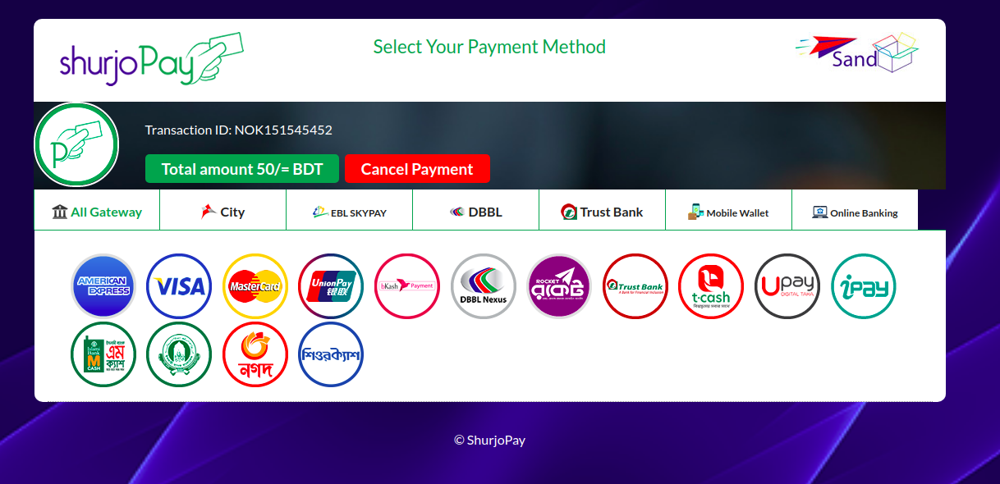

# ShurjoPay
shurjopay python integration steps

## Prerequisite
To integrate ShurjoPay you need few credentials to access shurjopay here's a test credentials for example:

```
MERCHANT_USERNAME = 'spaytest'
MERCHANT_PASSWORD = 'JehPNXF58rXs'
SHURJOPAY_URL = 'https://shurjotest.com/sp-data.php'
DECRYPT_URL = 'https://shurjotest.com/merchant/decrypt.php'
MERCHANT_PREFIX = 'NOK'
``` 
note*

**Create a POST API/ URL** 

e.g: http://127.0.0.1:8000/return_url/

A return URL is also required to be passed to the shurjoPay where a decrypted transaction info will be post.
so the return URL will be ```POST``` method and it will accept with ```spdata``` from shurjoPay.
## Installation

Use the package manager to install Shuropay python package
```
pip install -i https://test.pypi.org/simple/ shurjopay-pkg-tareq
```
## Usage
```
from shurjopay import shurjoPay

#initialize with the test credentials

testpay = shurjoPay.ShurjoPay(MERCHANT_USERNAME, MERCHANT_PASSWORD, SHURJOPAY_URL, DECRYPT_URL, MERCHANT_PREFIX)

```
now the payment transaction can be initiated and 
send ```client_ip```, ```transaction_id```, ```transaction_amount```, ```return_url``` with the ```send_request``` method
```
spform = testpay.send_request('127.0.0.1', 'NOK151545452', 50, "http://127.0.0.1:8000/return_url/")
```
note*

This ```testpay.send_request()``` will return an HTML shurjopay form you need to render this in your application for your users to complete the transaction.



After success/faild transaction; Transaction information will be sent to your rutrun URL in encrypted form. You should be able to access those from ```spdata```

To decrypt the transaction data from return url

```
xml = testpay.get_decrypt(spdata)
```
note* this data will be in ```xml``` form to convert it in ```json``` you can use any conversion method